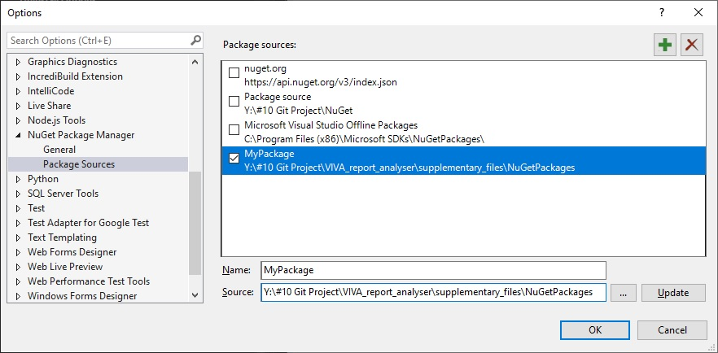

<h1 id="project_name" align="center">VIVA report analyser</h1>
<h2 id="content">Содержание</h2>
<ol>
<li><a href="#destiny">Предназначение</a></li>
<li><a href="#needwork">Для работы необходимо</a></li>
<li><a href="#nuget">Используемые пакеты NuGet</a></li>
</ol>

<h2 id="destiny" align="center">Предназначение</h2>
 
Программа ориентирована на обработку xml отчетов станка VIVA Pilot V8 NEXT производства Seica. Позволяет просматривать их в удобном читаемом виде, выполнять анализ результатов и генерировать отчеты.

<h2 id="needwork" align="center">Для работы необходимо</h2>
 
В проекте платы станка зайти в меню Board Options. В разделе Test Settings значение свойств Print All Tests Result, Print All Components Result, Save All the Reports установить значение 1.

<h2 id="nuget" align="center">Используемые пакеты NuGet</h2>
 
Все используемые в этом проекте пакеты NuGet лежат в [этой папке](supplementary_files/NuGetPackages).
 
NuGet Package Manager Setting:
 

​

<h1 id="functionality" align="center">Описание функционала приложения</h1>
<h2 id="inputfile" align="center">Входные файлы</h2>

Основные поддерживаемые программой файлы формата .xml структура которых описана в классе [ParseXml](VIVA_report_analyser/VIVA_report_analyser/ParseXml.cs).

Чтобы открыть xml файлы на просмотр - нажимаем кнопку добавить файлы.
Выбираем нужные файлы (можно несколько) и нажимаем Открыть.
Программа укажет на неподдерживаемый формат файлов, а остальные попытается добавить.
Все печатные платы (если их несколько в одном файле) откроются в своей вкладке
с: названием файла | номер платы | имя платы или баркод.
Вкладки можно закрывать и открывать уже закрытые, программа помнит ранее открытые файлы
до закрытия программы.
Расчет максимального отклонения выполняется ко всем открытым вкладкам.

## Sourses
+ [LINQ C#](https://devkazakov.com/ru/blog/linq-c-sharp/#_Filtering_operators)​
+ [LINQ to Objects](https://professorweb.ru/my/LINQ/base/level1/linq_index.php)​
+ [Проверка на null, операторы ?. и ??](https://metanit.com/sharp/tutorial/3.26.php)​
+ [WPF colors in Hex Code](https://wpfknowledge.blogspot.com/2012/05/note-this-is-not-original-work.html)​
+ [Логирование проекта с помощью NLog Framework](https://itvdn.com/ru/blog/article/logging-project-with-nlog-framework)​
+ [Winforms-Глобальные Переменные](https://askdev.ru/q/c-winforms-globalnye-peremennye-148192/)​
+ [Архитектура ПО в WinForms (FAQ & HowTo)](https://www.cyberforum.ru/windows-forms/thread1558189.html)​
+ [Метод, возвращающий разные типы данных C#](https://ru.stackoverflow.com/questions/457950/%D0%9C%D0%B5%D1%82%D0%BE%D0%B4-%D0%B2%D0%BE%D0%B7%D0%B2%D1%80%D0%B0%D1%89%D0%B0%D1%8E%D1%89%D0%B8%D0%B9-%D1%80%D0%B0%D0%B7%D0%BD%D1%8B%D0%B5-%D1%82%D0%B8%D0%BF%D1%8B-%D0%B4%D0%B0%D0%BD%D0%BD%D1%8B%D1%85-c)​
+ [C# как сделать парсер в Visual Studio](https://forum.orkons.ru/topic/362-c-kak-sdelat-parser-v-visual-studio/)​
+ [Проход по полям класса](https://www.cyberforum.ru/csharp-beginners/thread1661699.html)
+ [Сериализация объектов](https://professorweb.ru/my/csharp/thread_and_files/level4/4_1.php)
+ [Запомнить значение переменной между запусками программы](https://www.cyberforum.ru/csharp-beginners/thread1495318.html)
+ [Создание потоков и передача данных во время запуска](https://docs.microsoft.com/ru-ru/dotnet/standard/threading/creating-threads-and-passing-data-at-start-time)
+ [Работа с потоками в C# Joseph Albahari](https://rsdn.org/article/dotnet/CSThreading1.xml)
+ [Доступ к элементам управления формы из другого класса](https://translated.turbopages.org/proxy_u/en-ru.ru.03125158-63201c60-0aa0d039-74722d776562/https/stackoverflow.com/questions/12983427/accessing-forms-controls-from-another-class)
+ [Datagridview - формирование цвета строки по значению параметра](https://www.cyberforum.ru/windows-forms/thread153589.html)
+ [Изменяем внешний вид System.Windows.Forms.Form](https://coolcode.ru/izmenyaem-vneshniy-vid-system-windows-forms-form/)
+ [Сортируемый стобец ДАТЫ в DataGridView](https://stackoverflow.com/questions/3770857/how-do-i-implement-automatic-sorting-of-datagridview)
+ [Правильный способ реализовать панель прогресса в C#](https://stackoverflow.com/questions/6204749/the-right-way-to-implement-a-progressbar-in-c-sharp)
+ [String Format for Double [C#]](https://www.csharp-examples.net/string-format-double/)
+ [BackgroundWorker Класс](https://learn.microsoft.com/ru-ru/dotnet/api/system.componentmodel.backgroundworker?view=netframework-4.7)
+ [Не открывается OpenFileDialog в backgroundWorker](https://www.cyberforum.ru/windows-forms/thread773935.html)
+ [Как правильно информировать о процессе выполнения задачи?](https://qna.habr.com/q/203613)
+ [TabControl с горизонтальными вкладками слева](https://www.cyberforum.ru/csharp-net/thread232918.html)
+ [Перерисовка элемента управления TreeView](https://russianblogs.com/article/11771548371/)
+ [Реализация Drag and drop в WinForms приложении на C#](https://lexpenz.com/programmirovanie/csharp/realizaciya-drag-and-drop-v-winforms-prilozhenii-na-c.html)

## Contacts

- tps5430@yandex.ru

Stay tuned!